## Medical Research Database

A sql-based system for managing clinical trial data, patient records, study results, and drug information. This project provides a secure, interactive platform for researchers to store and analyze data, track study metadata, and generate insights.

### Features
- **Manage Clinical Trials**: Add and store clinical trial details.
- **Patient Records**: Maintain a database of patient details, including age and medical conditions.
- **Statistics Dashboard**: Generate insights like total trials and patient counts.
- **Responsive Design**: Optimized user interface with clean, professional styling.
- **Database Integration**: Data is securely stored using MySQL.

### Project Development Stages (SDLC Phases):
#### 1.	Planning:
-	Identified project objectives: 
-	Enable efficient management of clinical trial data.
-	Provide secure storage for patient records and study metadata.
-	Defined scope based on user requirements provided by research professionals.

#### 2.	Analysis:
-	Conducted requirements analysis to understand data relationships, such as between patients, trials, and study results.
-	Identified necessary tables: trials, patients, studies, results, drugs, and metadata.

#### 3.	Design:
-	Created an Entity-Relationship Diagram (ERD) for visualizing the database schema.
-	Applied normalization techniques to minimize redundancy and optimize storage.
-	Designed security features to protect sensitive data.

#### 4.	Implementation:
-	Used [specific DBMS, e.g., MySQL] to develop the database schema and implement the tables.
-	Inserted sample data for testing purposes.
-	Implemented core features: 
-	Managing clinical trial data and results.
-	Storing patient records securely.
-	Analyzing data trends.

#### 5.	Testing:
-	Performed functionality testing to ensure accurate data retrieval and updates.
-	Tested edge cases for data integrity and security (e.g., invalid inputs).

#### 6.	Deployment:
-	Prepared a demonstration for presenting the working database system to academic supervisors.
- Provided clear documentation, including database schema and user instructions.

#### 7.	Maintenance:
-	Proposed future maintenance strategies: 
-	Regular cleaning of outdated or non-relevant data.
-	Enhancing features like auto-spelling correction and real-time updates for ongoing trials.
-	Integrating dashboards for statistical analysis.

---

## Design and Development Lifecycle (DDLC): Medical Research Database

### 1. Description of Entities, Attributes, and Relationships

#### Entities and Attributes
1. **Patients**: Stores information about individuals participating in clinical trials.
   - **Attributes**: 
     - `Patient_ID` (Primary Key)
     - `Name`
     - `Age`
     - `Gender`
     - `Medical_History`
     - `Contact_Info`

2. **Clinical Trials**: Captures details of clinical trials.
   - **Attributes**: 
     - `Trial_ID` (Primary Key)
     - `Title`
     - `Start_Date`
     - `End_Date`
     - `Status`
     - `Result`

3. **Studies**: Contains metadata about specific studies conducted within trials.
   - **Attributes**: 
     - `Study_ID` (Primary Key)
     - `Name`
     - `Purpose`
     - `Protocol`
     - `Start_Date`
     - `End_Date`

4. **Results**: Stores findings and outcomes of studies.
   - **Attributes**: 
     - `Result_ID` (Primary Key)
     - `Study_ID` (Foreign Key)
     - `Patient_ID` (Foreign Key)
     - `Observation`
     - `Measurement`
     - `Timestamp`

5. **Drugs**: Holds information about drugs used or tested during trials.
   - **Attributes**: 
     - `Drug_ID` (Primary Key)
     - `Name`
     - `Manufacturer`
     - `Dosage`
     - `Side_Effect`

6. **Metadata**: Captures additional details relevant to studies and trials.
   - **Attributes**: 
     - `Metadata_ID` (Primary Key)
     - `Trial_ID` (Foreign Key)

#### Relationships
- **Patients** participate in one or more **Studies**.
- **Trials** encompass multiple **Studies**.
- **Studies** produce multiple **Results**.
- **Trials** may involve one or more **Drugs**.
- **Metadata** is associated with **Trials**.

---

### 2. Challenges and Considerations

- **Data Security**: Ensure patient confidentiality through encryption and controlled access.
- **Normalization**: Avoid redundancy by carefully structuring relationships between tables.
- **Data Integrity**: Define clear primary and foreign keys to maintain consistency.
- **Future Scalability**: Design the schema to accommodate additional attributes or tables.

---

### 3. Tables, Fields, and Data Types

| **Table Name** | **Field Name**      | **Data Type**   |
|-----------------|---------------------|-----------------|
| Patients        | `Patient_ID`        | INT (Primary Key) |
|                 | `Name`              | VARCHAR(255)    |
|                 | `Age`               | INT             |
|                 | `Gender`            | CHAR(1)         |
|                 | `Medical_History`   | VARCHAR(255)    |
|                 | `Contact_Info`      | VARCHAR(255)    |
| Trials          | `Trial_ID`          | INT (Primary Key) |
|                 | `Title`             | VARCHAR(255)    |
|                 | `Start_Date`        | DATE            |
|                 | `End_Date`          | DATE            |
|                 | `Status`            | VARCHAR(255)    |
|                 | `Result`            | VARCHAR(100)    |
| Studies         | `Study_ID`          | INT (Primary Key) |
|                 | `Name`              | VARCHAR(255)    |
|                 | `Purpose`           | VARCHAR(255)    |
|                 | `Protocol`          | VARCHAR(255)    |
|                 | `Start_Date`        | DATE            |
|                 | `End_Date`          | DATE            |
| Results         | `Result_ID`         | INT (Primary Key) |
|                 | `Study_ID`          | INT (Foreign Key) |
|                 | `Trial_ID`          | INT (Foreign Key) |
|                 | `Outcome`           | VARCHAR(255)    |
|                 | `Summary`           | VARCHAR(255)    |
|                 | `Date_Recorded`     | DATE            |
| Drugs           | `Drug_ID`           | INT (Primary Key) |
|                 | `Name`              | VARCHAR(255)    |
|                 | `Dosage`            | VARCHAR(255)    |
|                 | `Side_Effect`       | VARCHAR(255)    |
|                 | `Manufacturer`      | VARCHAR(255)    |
| Metadata        | `Metadata_ID`       | INT (Primary Key) |
|                 | `Trial_ID`          | INT (Foreign Key) |

---

### 4. Relationships Between Tables

- **Patients (`Patient_ID`) → Results (`Patient_ID`)**
- **Trials (`Trial_ID`) → Studies (`Trial_ID`)**
- **Studies (`Study_ID`) → Results (`Study_ID`)**
- **Trials (`Trial_ID`) → Metadata (`Trial_ID`)**
- **Trials (`Trial_ID`) → Drugs (`Drug_ID`)**

---

### 5. ERD to Relational Data Model (RDM)

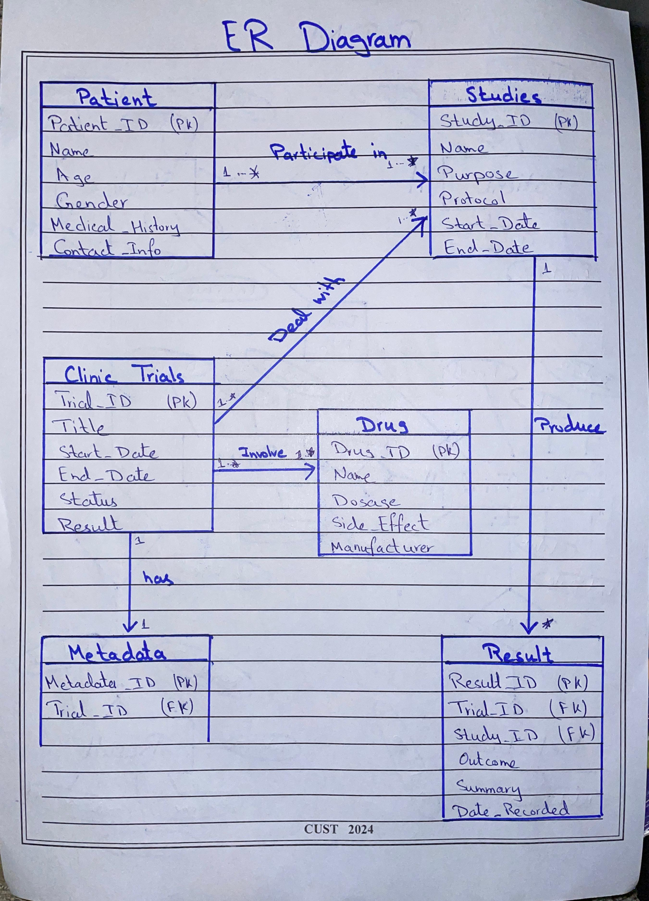

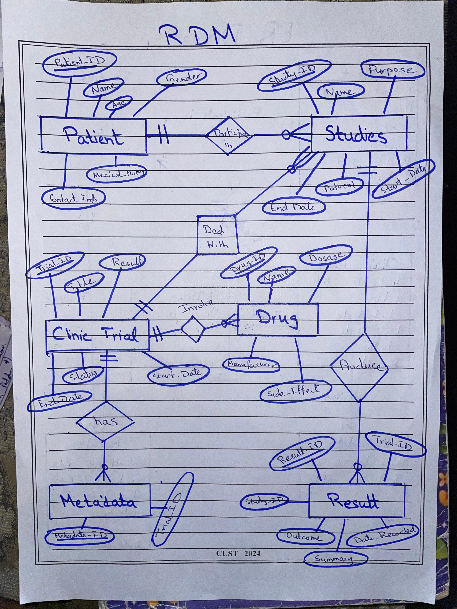

---

### 6. Brief Report

#### Design Decisions
- **Entity Selection**: Focused on entities essential for managing clinical trial data.
- **Normalization**: Designed to third normal form (3NF) to minimize redundancy.
- **Data Security**: Included encryption considerations for sensitive fields (e.g., `Contact_Info`, `Medical_History`).
- **Data Types**: Used appropriate data types for each attribute (e.g., `DATE`, `VARCHAR`).
- **Scalability**: The schema accommodates future growth and modifications.

#### Challenges
- Balancing normalization with performance (e.g., adding indexes on frequently queried fields).
- Incorporating future-proof features like support for machine learning tools.
- Ensuring compliance with data privacy regulations.

---

## Clinical Trials Database Management

## 1. Database Implementation

### Creating Tables

```sql
CREATE TABLE patients (
    Patient_ID INT PRIMARY KEY,
    Patient_Name VARCHAR(255),
    Patient_Age INT(3),
    Patient_Gender VARCHAR(10),
    Patient_Contact VARCHAR(20),
    Medical_History VARCHAR(255)
);
```

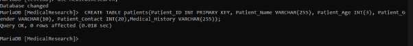

```sql
CREATE TABLE trials (
    Trial_ID INT PRIMARY KEY,
    Trial_Title VARCHAR(255),
    Trial_StartDate DATE,
    Trial_EndDate DATE,
    Status VARCHAR(255),
    Result VARCHAR(255)
);
```

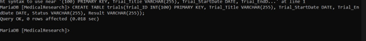

```sql
CREATE TABLE studies (
    Study_ID INT PRIMARY KEY,
    Study_Name VARCHAR(255),
    Study_Purpose VARCHAR(255),
    Study_StartDate DATE,
    Study_EndDate DATE,
    Protocol VARCHAR(255)
);
```

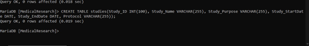

```sql
CREATE TABLE results (
    Result_ID INT PRIMARY KEY,
    Trial_ID INT,
    Study_ID INT,
    Outcome VARCHAR(255),
    Summary VARCHAR(255),
    Date_Recorded DATETIME
);
```


```sql
CREATE TABLE drugs (
    Drug_ID INT PRIMARY KEY,
    Drug_Name VARCHAR(255),
    Drug_Dosage VARCHAR(255),
    Side_Effect VARCHAR(255),
    Manufacturer VARCHAR(255)
);
```

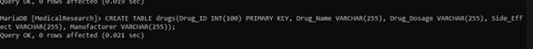

```sql
CREATE TABLE metadata (
    Metadata_ID INT PRIMARY KEY AUTO_INCREMENT,
    Trial_ID INT
);
```


---

## 2. Data Population

### Inserting Data into Tables

```sql
INSERT INTO patients VALUES 
(1, 'Patient 1', 45, 'Male', '92332145846', 'Hypertension'),
(2, 'Patient 2', 32, 'Female', '9212345846', 'Diabetes'),
(3, 'Patient 3', 68, 'Male', '9212345844', 'Asthma');
```


```sql
INSERT INTO trials VALUES 
(1, 'Trial A', '2024-11-01', '2024-12-29', 'Completed', 'Positive'),
(2, 'Trial B', '2024-10-05', '2025-01-08', 'Completed', 'Negative'),
(3, 'Trial C', '2024-12-10', '2024-12-28', 'Ongoing', NULL);
```

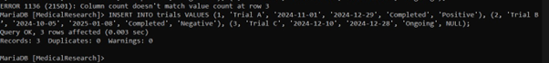

```sql
INSERT INTO studies VALUES 
(1, 'Study A1', 'Blood pressure analysis', '2024-11-01', '2024-12-29', 'Protocol A1'),
(2, 'Study B1', 'Blood sugar analysis', '2024-10-05', '2025-01-08', 'Protocol B1');
```

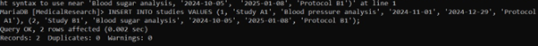

```sql
INSERT INTO results VALUES 
(1, 1, 1, 'Normal BP', '120/80', '2024-11-01 10:00:00'),
(2, 2, 2, 'Elevated Sugar', '180 mg/dL', '2024-10-05 09:00:00');
```

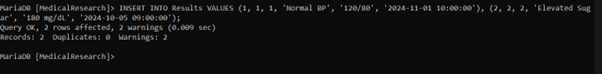

```sql
INSERT INTO drugs VALUES 
(1, 'Drug A', '50mg', 'Nausea', 'Pharma Inc.'),
(2, 'Drug B', '100mg', 'Headache', 'HealthCorp');
```


```sql
INSERT INTO metadata VALUES 
(1, 1),
(2, 2);
```


---

## 3. SQL Queries

### Selection

```sql
SELECT * FROM patients WHERE Patient_Age > 40;
```
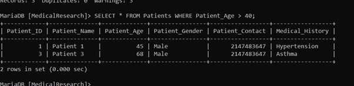

```sql
SELECT * FROM drugs WHERE Drug_Dosage = '50mg';
```

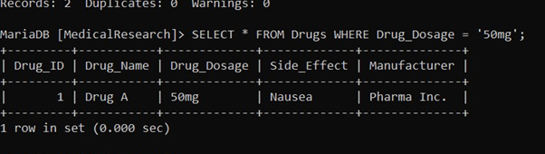
```sql
SELECT * FROM trials WHERE Status = 'Completed';
```
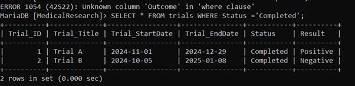

### Projection

```sql
SELECT Patient_Name, Patient_Age FROM patients;
```
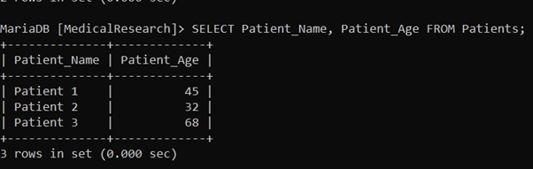

```sql
SELECT Trial_Title, Status FROM trials;
```
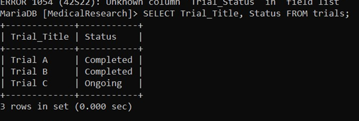

```sql
SELECT Drug_Name, Drug_Dosage FROM drugs;
```
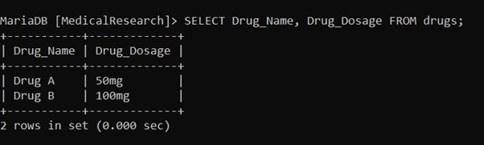

### Join

```sql
SELECT s.Study_Name, t.Trial_Title 
FROM studies s 
JOIN trials t ON s.Study_ID = t.Trial_ID;
```
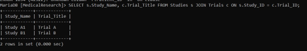

```sql
SELECT d.Drug_Name 
FROM drugs d 
JOIN results r ON d.Drug_ID = r.Study_ID;
```
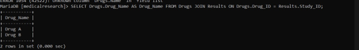

```sql
SELECT s.Study_Name, d.Drug_Name 
FROM studies s 
LEFT JOIN drugs d ON s.Study_ID = d.Drug_ID;
```
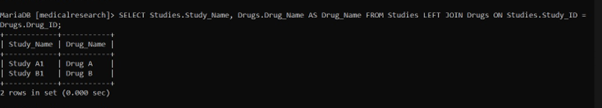

### Aggregation

```sql
SELECT AVG(Patient_Age) AS Average_Age FROM patients;
```
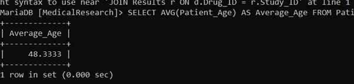

```sql
SELECT COUNT(*) AS Total_Trials FROM trials;
```
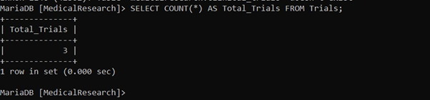

```sql
SELECT MIN(Patient_Age) AS Youngest_Patient FROM patients;
```
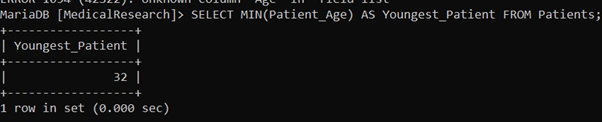

### Subquery

```sql
SELECT Drug_ID, Drug_Name FROM drugs 
WHERE Drug_ID IN (SELECT Study_ID FROM results WHERE Summary LIKE '%mg/dL');
```
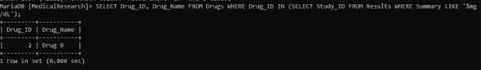

```sql
SELECT Trial_Title FROM trials 
WHERE Trial_ID IN (SELECT Trial_ID FROM metadata);
```
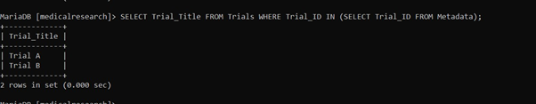

### CRUD Operations

-- Create
```sql
INSERT INTO patients VALUES (4, 'Patient 4', 23, 'Male', '922365659', 'Anxiety');
```


-- Read
```sql
SELECT * FROM patients;
```
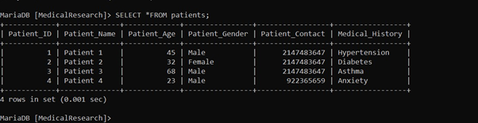

-- Update
```sql
UPDATE patients SET Medical_History = 'Malaria' WHERE Patient_ID = 3;
```
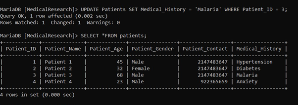

-- Delete
```sql
DELETE FROM patients WHERE Patient_ID = 3;
```
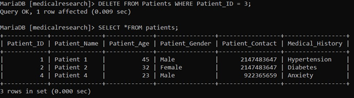

---

## 4. Relational Algebra Queries

- **Selection:**  
  σ Age > 40 (Patients)  
  σ Gender = 'Female' (Patients)

- **Projection:**  
  π Name, Age (Patients)  
  π Title (Clinical_Trials)

- **Join:**  
  Patients ⟒ Results  
  Studies ⟒ Clinical_Trials

- **Union:**  
  π Name (Patients) ∪ π Name (Doctors)

- **Difference:**  
  π Patient_ID (Patients) - π Patient_ID (Results)

- **Cartesian Product:**  
  Patients × Drugs

- **Natural Join:**  
  Patients ⟒ Results

